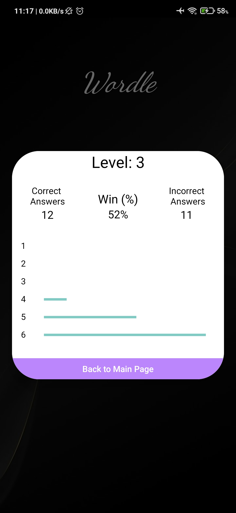
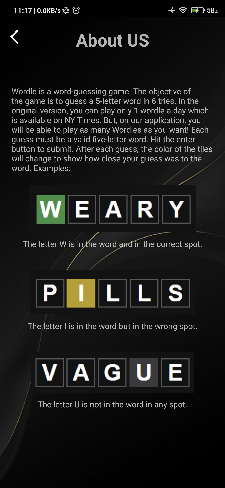

# Wordle

Apk (.apk) Link:

https://drive.google.com/file/d/1gksx_cOigCYzPTlNAINfFe8-C_RiSzSj/view?usp=sharing

# How to Play:

1) Install the apk from the above link and open it, you will see the below screen :

 
2) After a break of 2 seconds, you will be redirected to the menu page of the game where you can find the play button, view score button, about us and exit as follows:

 
3) On clicking on play, you can play the famous wordle game as below:

 
4) If you lose the game, you will see the screen as follows with one toast saying "The word was xxxxx".

 
5) But if you win the game, you will see the screen as follows.

 
6) Whenever your level gets up, you will find out the below screen with some animation.

 
7) After playing the game, you will be redirected to the menu page and on clicking view score button you will see the page as follows:

 
8) You can even check how to play button.

 
9) On clicking on exit you can check our portfolio as below and the game will be closed.

 

